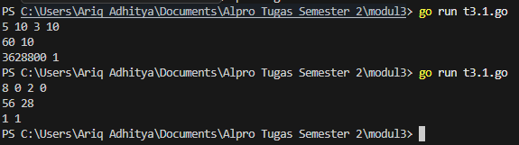
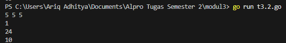
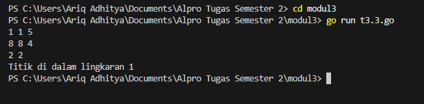

# <h1 align="center">Laporan Praktikum Modul 3 </h1>
<p align="center"> Rizkyta putri aulia - 109082500136 </p>

## Unguided 

### 1. Soal Latihan Modul 3 - 1
Minggu ini, mahasiswa Fakultas Informatika mendapatkan tugas dari mata kuliah matematika
diskrit untuk mempelajari kombinasi dan permutasi. Jonas salah seorang mahasiswa, iseng
untuk mengimplementasikannya ke dalam suatu program. Oleh karena itu bersediakah kalian
membantu Jonas?

#### t3.1.go

```go
package main

import (
	"fmt"
)

func faktorial(n int) int {
	result := 1
	for i := 2; i <= n; i++ {
		result *= i
	}
	return result
}

func permutasi(n, r int) int {
	return faktorial(n) / faktorial(n-r)
}

func kombinasi(n, r int) int {
	return faktorial(n) / (faktorial(r) * faktorial(n-r))
}

func main() {
	var a, b, c, d int

	fmt.Scan(&a, &b, &c, &d)

	fmt.Println(permutasi(a, c), kombinasi(a, c))
	fmt.Println(permutasi(b, d), kombinasi(b, d))
}
```
### Output Unguided :

##### Output 


Program ini dibuat dengan bahasa Go untuk menghitung permutasi dan kombinasi dari angka yang dimasukkan pengguna. Tujuannya adalah mengetahui jumlah kemungkinan susunan dan pilihan dari suatu angka. Fungsi faktorial digunakan untuk menghitung perkalian berurutan dari suatu angka (misalnya 5! = 5×4×3×2×1). Fungsi ini menjadi dasar untuk perhitungan lainnya. Fungsi permutasi menghitung banyaknya cara menyusun objek dengan memperhatikan urutan, sedangkan fungsi kombinasi menghitung banyaknya cara memilih objek tanpa memperhatikan urutan. Di bagian main, program membaca 4 angka lalu menghitung permutasi dan kombinasi dari dua pasangan angka tersebut, kemudian menampilkan hasilnya ke layar.


### 2. Soal Latihan Modul 3 - 2
#### t3.2.go

```go
package main

import "fmt"

func f(x int) int {
	return x * x
}

func g(x int) int {
	return x - 2
}

func h(x int) int {
	return x + 1
}

func main() {

	var a, b, c int

	fmt.Scan(&a, &b, &c)

	hasil1 := f(g(g(a)))

	hasil2 := g(h(f(b)))

	hasil3 := h(f(g(c)))

	fmt.Println(hasil1)
	fmt.Println(hasil2)
	fmt.Println(hasil3)
}
```
### Output Unguided :

##### Output 


Program ini menggunakan bahasa Go untuk menghitung hasil dari beberapa fungsi matematika sederhana yang saling digabungkan. Terdapat tiga fungsi, yaitu f(x) untuk menghitung kuadrat (x × x), g(x) untuk mengurangi nilai x dengan 2, dan h(x) untuk menambah nilai x dengan 1. Masing-masing fungsi memiliki peran berbeda dalam proses perhitungan. Di bagian main, program meminta pengguna memasukkan tiga angka, yaitu a, b, dan c. Setelah itu, program melakukan perhitungan bertahap dengan menggabungkan fungsi-fungsi tersebut, seperti memanggil fungsi di dalam fungsi lainnya. Hasil perhitungan disimpan dalam tiga variabel (hasil1, hasil2, dan hasil3), lalu ditampilkan ke layar. Program ini menunjukkan bagaimana fungsi bisa digabung untuk menghasilkan perhitungan yang lebih kompleks.


### 3. Soal Latihan Modul 3 - 3
#### t3.3.go

```go
package main

import "fmt"

func main() {
	var cx1, cy1, r1 int
	var cx2, cy2, r2 int
	var x, y int

	fmt.Scan(&cx1, &cy1, &r1)
	fmt.Scan(&cx2, &cy2, &r2)
	fmt.Scan(&x, &y)

	jarak1 := (x-cx1)*(x-cx1) + (y-cy1)*(y-cy1)
	jarak2 := (x-cx2)*(x-cx2) + (y-cy2)*(y-cy2)

	diDalam1 := jarak1 <= (r1 * r1)
	diDalam2 := jarak2 <= (r2 * r2)

	if diDalam1 && diDalam2 {
		fmt.Println("Titik di dalam lingkaran 1 dan 2")
	} else if diDalam1 {
		fmt.Println("Titik di dalam lingkaran 1")
	} else if diDalam2 {
		fmt.Println("Titik di dalam lingkaran 2")
	} else {
		fmt.Println("Titik di luar lingkaran 1 dan 2")
	}
}
```
### Output Unguided :

##### Output 


Program ini digunakan untuk mengecek posisi sebuah titik terhadap dua lingkaran. Tujuannya adalah mengetahui apakah titik tersebut berada di dalam salah satu lingkaran, kedua lingkaran, atau di luar semuanya. Di awal, program meminta pengguna memasukkan data dua lingkaran (titik pusat dan jari-jari) serta satu titik yang ingin dicek posisinya. Selanjutnya, program menghitung jarak titik ke masing-masing pusat lingkaran (tanpa akar, supaya lebih sederhana). Hasil jarak ini kemudian dibandingkan dengan jari-jari lingkaran. Jika jarak titik lebih kecil atau sama dengan jari-jari, berarti titik berada di dalam lingkaran tersebut. Program lalu mengecek semua kemungkinan dan menampilkan hasilnya, apakah titik ada di lingkaran 1, lingkaran 2, keduanya, atau di luar keduanya.

